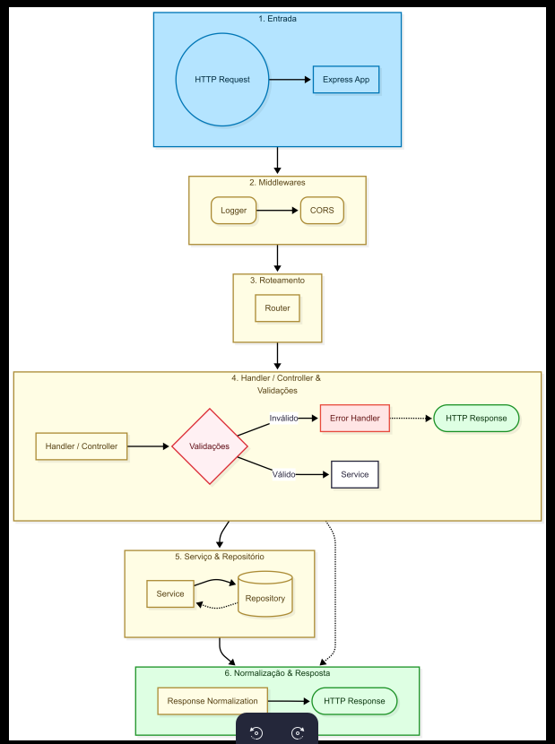

# Application Flow

## Entry Point

- server.js inicia a aplicação
- app.js configura middlewares e rotas

## Request Flow

1. Request entra no Express
2. Middlewares globais (logger, cors)
3. Routing
4. Handler

## Handler

- Recebe input
- Extrai parâmetros e body
- Dispara validações (delega para camada de Validation)
- Orquestra a chamada do Service
- Não contém regra de negócio

## Validation

- Valida entrada e garante contrato
- É aqui que o contrato é garantido: após essa etapa, a aplicação assume contratos explícitos, eliminando responsabilidade implícita do desenvolvedor
- Esse comportamento é garantido por testes unitários e de integração

## Service

- Contém regra de negócio
- Normaliza retorno (ex: sempre array)

## Repository

- Acesso a dados
- Sem regra de negócio

## Error Handling

- Centralizado
- Converte erros para HTTP

## Tests

- **Unit**: Testa regras isoladas, garantindo que validações e services funcionam corretamente
- **Integration**: Testa o fluxo real end-to-end, validando que o contrato garantido pelas validações é respeitado em toda a aplicação
- **Execução separada**: Permite rodar testes unitários rapidamente e testes de integração quando necessário
- **Responsabilidade validada**: Os testes garantem que a responsabilidade implícita do desenvolvedor foi transformada em contrato explícito e testado

## High Level Flow

O diagrama abaixo representa o fluxo de execução de uma requisição do ponto de entrada até a resposta final, incluindo validações, regras de negócio e tratamento de erros.

## Descrição do Flow

O fluxo completo de uma requisição HTTP na aplicação segue os seguintes estágios:

### 1. Entrada (HTTP Request)

A requisição HTTP chega ao servidor Express através de um endpoint específico (ex: `POST /api/v1/user`).

### 2. Express App

O Express recebe a requisição e inicia o processamento através da aplicação configurada em `app.js`.

### 3. Middlewares Globais

A requisição passa por middlewares na seguinte ordem:

- **Logger Middleware**: Registra informações da requisição (método, URL, IP, user-agent) e tempo de resposta
- **CORS**: Valida se a origem da requisição está na whitelist configurada, bloqueando requisições não autorizadas

### 4. Roteamento (Router)

O Express Router direciona a requisição para a rota apropriada baseado no path e método HTTP:

- Rotas de usuário: `/api/v1/user/*` → `userRoutes`
- Rotas de posts: `/api/v1/post/*` → `postRoutes`

### 5. Handler / Controller

O handler específico é chamado e executa:

- **Recebe a requisição**: Extrai parâmetros da URL (`req.params`) e corpo da requisição (`req.body`)
- **Dispara validações**: Delega a validação para a camada de Validation (não implementa a validação em si)
- **Orquestra a chamada do Service**: Passa os dados validados para a camada de serviço

### 6. Validações

A camada de Validation é onde o contrato é garantido:

- **Valida entrada**: Verifica tipos, obrigatoriedade, formato e regras de negócio básicas
- **Garante contrato explícito**: Após essa etapa, a aplicação assume contratos explícitos, eliminando responsabilidade implícita do desenvolvedor
- **Comportamento testado**: Esse comportamento é garantido por testes unitários e de integração
- **Se inválido**: Retorna erro de validação (400 Bad Request) através do Error Handler
- **Se válido**: Prossegue para a camada de Service

### 7. Service (Regra de Negócio)

O service processa a requisição:

- **Aplica regras de negócio**: Validações específicas (email único, senha forte, autor existe, etc)
- **Orquestra operações**: Pode chamar múltiplos repositories ou services
- **Interage com Repository**: Solicita operações no banco de dados quando necessário
- **Normaliza retorno**: Garante formato consistente (ex: sempre retorna objeto único para busca por ID, array para listagens)

### 8. Repository (Acesso a Dados)

O repository executa operações no banco:

- **Recebe requisição do Service**: Dados já validados e processados
- **Executa queries SQL**: Via Knex.js, realiza INSERT, SELECT, UPDATE ou DELETE
- **Gerencia transações**: Garante atomicidade em operações complexas
- **Retorna dados**: Retorna resultado da operação para o Service

### 9. Normalização de Resposta

Após processamento completo:

- **Service normaliza dados**: Remove campos sensíveis (senha), formata estrutura
- **Handler formata resposta HTTP**: Define status code apropriado (200, 201, 204, etc)
- **Prepara resposta final**: Estrutura dados no formato esperado pela API

### 10. HTTP Response

A resposta é enviada ao cliente:

- **Status code**: Indica sucesso (2xx) ou erro (4xx, 5xx)
- **Body**: Dados formatados em JSON
- **Headers**: Configurados automaticamente pelo Express

### Tratamento de Erros

Em qualquer ponto do fluxo, se ocorrer um erro:

- **Erro capturado**: Try/catch em cada camada
- **Error Handler centralizado**: Converte erros de domínio em respostas HTTP apropriadas
- **Logging**: Erro é registrado com contexto completo (error_id, request info, stack trace se crítico)
- **Resposta de erro**: Cliente recebe resposta HTTP com código e mensagem apropriados

### Exemplo Prático: Criar Usuário

1. **HTTP Request**: `POST /api/v1/user` com `{email, password, full_name}`
2. **Middlewares**: Logger registra requisição, CORS valida origem
3. **Router**: Direciona para `userRoutes.post('/')`
4. **Handler**: `createUserHandler` recebe dados
5. **Validações**: Verifica se email, senha e nome são válidos
   - Se inválido → 400 Bad Request
6. **Service**: `createUserService` verifica se email já existe, criptografa senha
7. **Repository**: `createUserRepositories` insere no banco
8. **Normalização**: Remove senha do retorno
9. **HTTP Response**: `201 Created` com `{user_id, email, full_name}`
